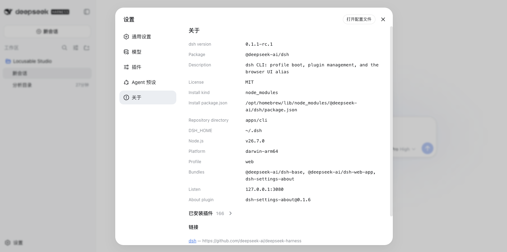

# dsh-settings-about

[English](README.md) | [中文](README.zh.md)

DeepSeek Harness（`dsh`）插件：在 **设置 → 关于** 展示**当前正在运行的** dsh 进程核实信息，以及已安装插件清单（id、模块、版本、启用、fiber 状态）。



## 版本限制（必读）

| 项 | 限制 |
| --- | --- |
| **dsh** | **仅支持 `@deepseek-ai/dsh@0.1.1-rc.1`**（`0.1.1-rc.*`、凭证文档 **version 1**） |
| **不支持** | `@deepseek-ai/dsh@0.1.0-rc.*` 及更早（无 `version` / `refs` 的扁平 `.credentials.yaml`） |
| **Profile** | **仅 `web`**（本包装有浏览器 `dsh.client` UI） |
| **Node.js** | 以该 dsh 版本要求为准（通常 `^22.19 \|\| >=24`，以你的安装为准） |
| **pnpm** | 必须在 `PATH` 上（`dsh plugin` 转发给 pnpm） |

请先安装 / 升级 dsh：

```sh
npm install -g @deepseek-ai/dsh@0.1.1-rc.1
dsh --version   # 必须输出 0.1.1-rc.1
```

凭证须为 v1 布局（`version: 1` + `refs:`）。若仍是预发布扁平文件，用 `0.1.1-rc.1` 启动一次 `dsh web` 让其迁移，或手动转换——**不要**用 `0.1.0` 去读 v1 文件（反之亦然）。

## 安装

```sh
dsh plugin --profile web add github:sha2kyou/dsh-settings-about
dsh web
```

本地目录：

```sh
git clone https://github.com/sha2kyou/dsh-settings-about.git
dsh plugin --profile web add ./dsh-settings-about
```

然后打开 **设置 → 关于**。

卸载：

```sh
dsh plugin --profile web remove dsh-settings-about
```

## 可选：侧栏感叹号图标

设置侧栏图标由 `@deepseek-ai/dsh-client-ui-settings-general` 按 section `id` 写死（未知 id 用齿轮）。将 `about` 映射为 `IconWarningOutline16`：

```sh
node scripts/patch-about-nav-icon.mjs
# 然后重启 dsh web
```

升级全局 dsh 后若图标变回齿轮，再跑一次。

## 页面内容

只展示能从当前进程核实的字段；解析不到则省略或写入 notes，不编造。

| 项 | 来源 |
| --- | --- |
| dsh 版本 / license / description / 包名 | `dirname(realpath(process.argv[1]))/../package.json`（与 `dsh` `lib/bin.js` 相同） |
| 仓库链接 | 该 `package.json` 的 `repository.url`（可转为 http(s) 时） |
| DSH_HOME | 同一套安装中的 `@deepseek-ai/dsh-home-paths` |
| Node / 平台 | `process.version` / `platform` / `arch` |
| Profile / bundles | argv / 路径 / `$DSH_HOME/profiles/<name>/package.json` |
| Listen | 请求时的 `webServer.host:port` |
| 已安装插件 | Cordis Loader 条目（版本来自可解析的 `package.json`）。`builtin` 仅按 profile `dependencies` 判定（Loader 无官方来源）。UI 可隐藏 `builtin: true`。 |

## 文件结构

| 文件 | 作用 |
| --- | --- |
| `index.js` | Host 插件 — `GET /dsh-about/info` |
| `collect.js` | 快照收集 |
| `client.js` | 浏览器 ModuleLoader bundle — `settings.section` `about` |
| `cordis.patch.yml` | 组合包 insert |
| `scripts/patch-about-nav-icon.mjs` | 可选侧栏图标补丁 |

## License

[MIT](LICENSE)
